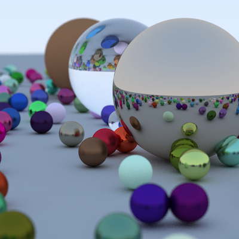
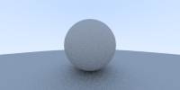
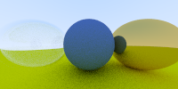
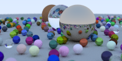

# raytracing_oneweek_rust

## Abstract

This is a straightforward
[Ray Tracing In One Weekend](https://github.com/RayTracing/raytracing.github.io/tree/master)
implementation in Rust.
This book describes how to implement simple and concise ray tracing implementation.



## How to build

### System

I've built this program on MacOS and Windows PC.

### Install Rust

This repository needs Rust and Cargo installation. You can install Rust from
[Official Rust Page](https://www.rust-lang.org/tools/install).

### Clone from GitHub Repository

```console
$ git clone git@github.com:y-tomita/raytracing_oneweek_rust.git
```

### Execute This Program

I've implemented each chapter, so you can compile and confirm them.
When you execute this program, you have to input image width, height, and chapter number as arguments.

This program print the PPM format text.
So you can obtain PPM image by using stdout redirect.

```console
# change to repository path
$ cd raytracing_oneweek_rust

# execute this program
$ cargo build [image width] [image height] [chapter number] > [imagename].ppm

# example
$ cargo build 200 100 1 > ch1.ppm

# I have prepared shell program
$ sh run.sh [chapter numger]
```

You can select chapter number from 1 to 11.
(Chapter 2 has no image, so I don't implement it. So you can't input [chapter 2] as aurgument. Sorry!)

If you input chapter number 0, you can get this page's teaser image.
When you input chapter number 0 or big image size, it takes very long time to calculate.
So be careful when you execute it.

After you execute this program, you can obtain PPM file.
MacOS can view PPM file by default.
If your system doesn't support it, you should be able to find PPM file viewers online.

## Result

|-|-|-|-|
|:---:|:---:|:---:|:---:|
|ch1|ch2|ch3|ch4|
||no image|||
|ch5|ch6|ch7|ch8|
|||||
|ch9|ch10|ch11|ch0(teaser)|
|||||

## Acknowledgments

I'm a beginner Rustacean, so I've refered to
[rushtonality's RayTracing rust implementation](https://github.com/rushtonality/my-tour-of-rust/tree/master/day4).