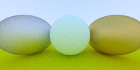

# raytracing_oneweek_rust

## Abstract

This is a straightforward
[Ray Tracing In One Weekend](http://in1weekend.blogspot.com/2016/01/ray-tracing-in-one-weekend.html)
implementation in Rust.


## How to build

### Install Rust

This repository needs Rust and Cargo installation. You can install Rust from
[Official Rust Page](https://www.rust-lang.org/tools/install).

### Execute This Program

I've implemented each chapter, so you can compile and confirm each chapter's result.
When you execute this program, you have to input image width, height, and chapter number as arguments.


```console
# change to repository path
$ cd raytracing_oneweek_rust

# execute this program
$ cargo build [image width] [image height] [chapter number] > [imagename].ppm

# example
$ cargo build 200 100 1 > ch1.ppm
```

You can select chapter number from 1 to 11.
You input chapter number 0, you can get this page's teaser image.
It takes very long time to calculate chapter 0's program or input big image size, so be careful when you execute it.

## Result

|ch1|ch2|ch3|ch4|
|---|---|---|---|
||no image|||
|ch5|ch6|ch7|ch8|
|||||
|ch9|ch10|ch11|teaser(ch0)|P
|||||

## Acknowledgments